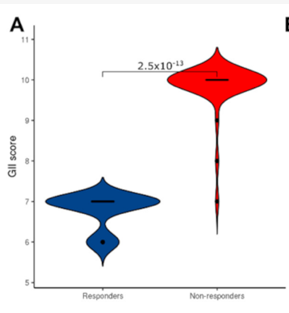

# Genome Instability Index (GII) and Fraction of Genome Altered (FGA)
## Calculate the percentage of genome affected by copy number gains or losses. 

*Proportions of the genome affected by copy-number changes (GII). Izadi et al. 2021*
