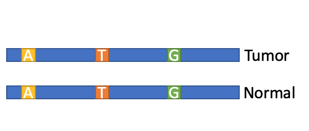

# KASP Kompetitive Allele Specific PCR
  
24 SNPs within protein coding regions are sufficient to discriminate relatives and to barcode an individual.
When in doubt of sample switch (e.g. you see a suspiciously high number of SNV in your T sample with respect of N sample, as if the T and the N belonged to 2 different individuals)
genotyping the samples for these 24 SNPs will help.

If T and N (e.g. paracancerous tissue or blood) samples belong to the same individual we expect to see a 100% match in the KASP SNVs position.

