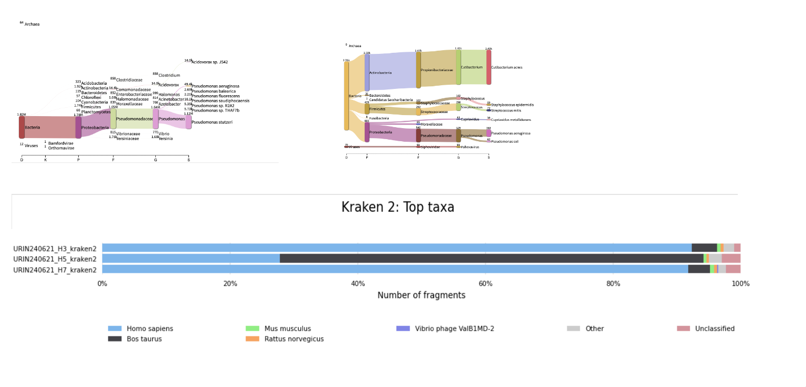

# Check your samples contamination with KRAKEN2 (extended database)

Wood, Derrick E., Jennifer Lu, and Ben Langmead. "Improved metagenomic analysis with Kraken 2." Genome biology 20.1 (2019): 1-13.
  

*Kraken database*
