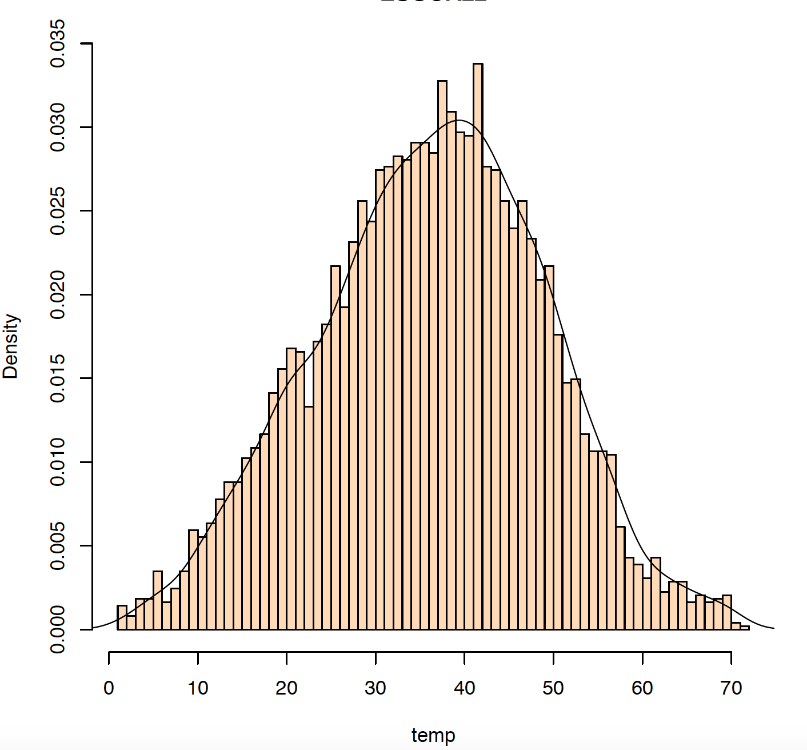
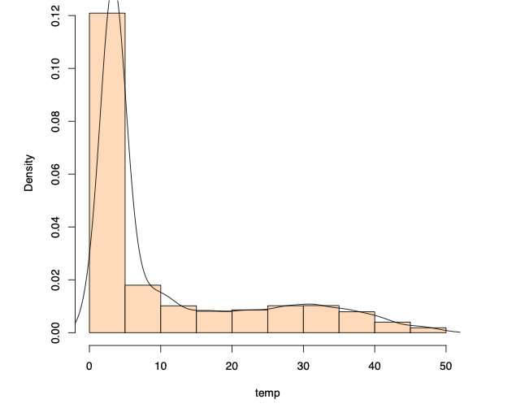

# Check MPOS from VCF
  
Check where your variants occur on the sequenced read.
The ideal unbiased output is a bell shaped curve.
 
If the reads are 150 bp long we expect an X axes of 75. If the reads are 100 bp, the x-axis should be 50 bp long. 

This analysis helps to detect biases during the calling. 

*A good symmetric curve*

*A curve reflecting a bias.*
*The reads have not been trimmed, and soft clipped regions have not been excluded from calling.*
*This results in artifactual calling in the adapter region (first 5bp of the read)*
