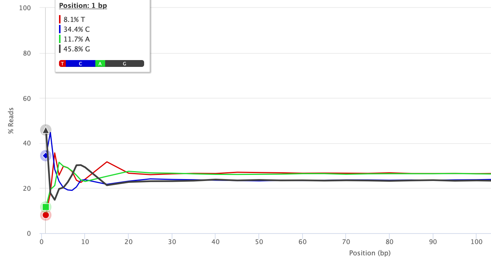
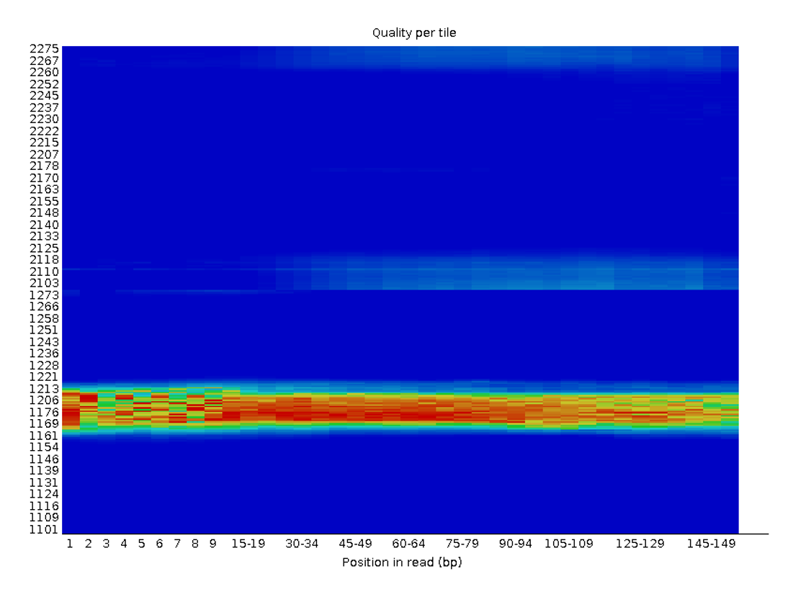
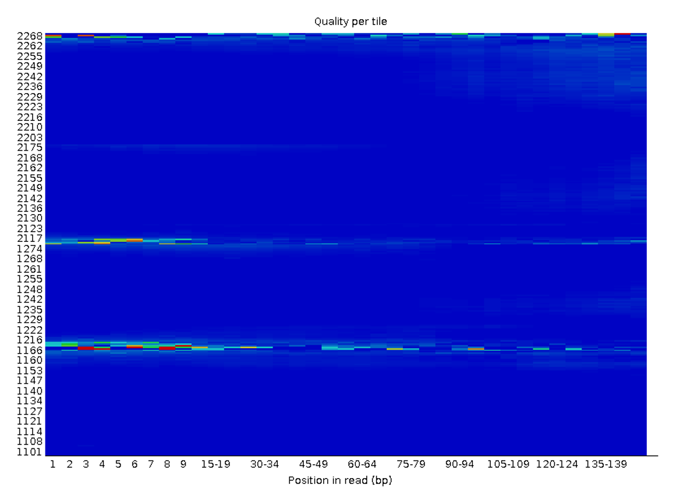

# GATK4 mutect (gatk4=4.2.2.0) variant calling pipeline

###In this pipeline we take care of issues such as:

### Bad quality bases at the beginning of the reads (residues of adapters, primers, bases with unbalanced gc content etc.)
(https://jgi.doe.gov/data-and-tools/software-tools/bbtools/bb-tools-user-guide/bbduk-guide/)

*Example of nucleotides to be trimmed at the beginning of a read*

### Bad quality of tiles (resulting from the presence of dust, bubbles, scratches on the flowcell surface or caused by overloadaded flowcell) that can result in artifactual insertion and deletion calls as described here:
https://sequencing.qcfail.com/articles/position-specific-failures-of-flowcells/

(https://github.com/abiswas-odu/Disco/blob/master/bbmap/filterbytile.sh)

*Example of bad tile before correction*

*Example of bad tile after correction*

## Short insert sizes resulting in overlapping FW and REV PE reads 
(https://genome.sph.umich.edu/wiki/BamUtil:_clipOverlap)

