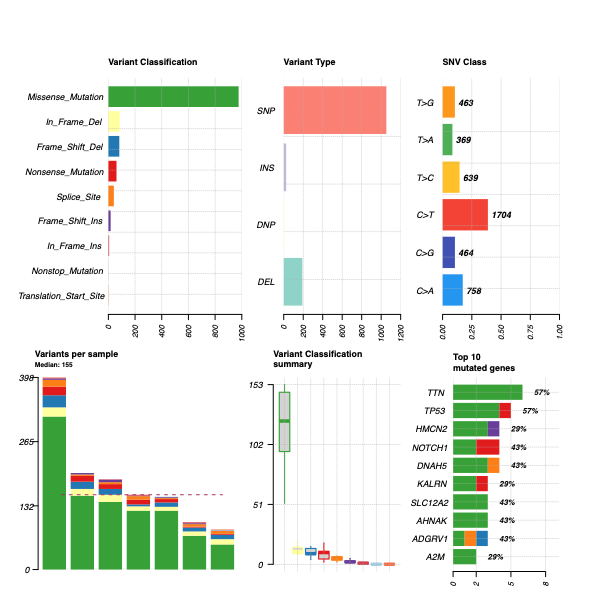

# Summarize, Analyze and Visualize MAF Files with Maftools
## Identify frequent mutations, patterns and outliers in your data with this really nice package!
### https://www.bioconductor.org/packages/devel/bioc/vignettes/maftools/inst/doc/maftools.html

*Example summary*

