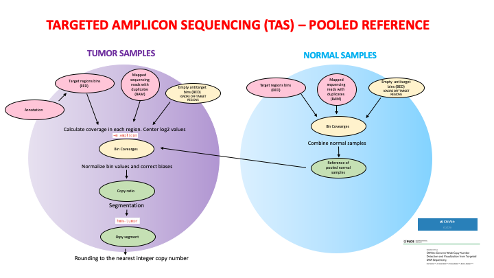
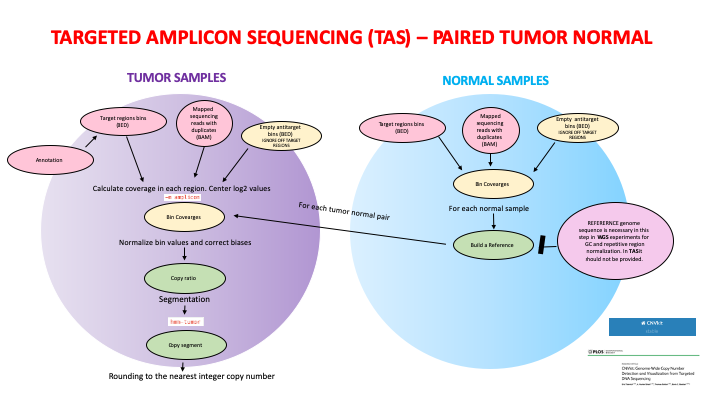

#TAS#

### Snakemake for Targeted Amplicon Sequencing analysis with CNVkit  ###

Starting from .bam files obtained with IonTorrent technology, CNVkit is used to call CNV.

## STRATEGY3_pool_normal_references_TAS

CNVkit batch strategy. Tumor samples vs pooled reference of normal samples. 

input files

- BAM tumor : Mapped sequence tumor reads (.bam).
- BAM normal: Mapped sequence normal reads (.bam).
- Target regions : BED or interval file listing the targeted regions.
- Annotation file  (.refFlat.txt)
- Fish file

output files

- CNV segment files (.cns)
- CNV segment files with integer copy numbers (.call.cns)
- MET_summary.tsv (comparison between gains and losses in NGS data vs FISH data for the gene of interest)
-  CNVKIT_PLOTS (diagram, scatter, heatmap, density)

intermediate files

- antitarget empty file
- for each TUMOR sample the target coverage (.cnn)
- for each NORMAL sample the target coverage (.cnn)
- for each TUMOR sample the antitarget coverage (.cnn)
- normal reference : reference built from pooled normal samples (.cnn).
- copy number ratio files (.cnr)
- target genes with CN gain or loss (.gene.gainloss.txt)
- get number of genes in each cnv (.call.num_genes.cns)
- exploded gene table (call.genes.tsv)
- focus on gene of interest (.call.gene.tsv)
- ...

## STRATEGY4_pairs_tumor_normal_TAS

CNVkit step by step strategy. Tumor samples vs pooled reference of normal samples. 

input files

- BAM tumor : Mapped sequence tumor reads (.bam).
- BAM normal Mapped sequence normal reads (.bam).
- Target regions : BED or interval file listing the targeted regions.
- Annotation file (.refFlat.txt)

output files

- CNV segment files (.cns)
- CNV segment files with integer copy numbers (.call.cns)
- MET_summary.tsv (comparison between gains and losses in NGS data vs FISH data for the gene of interest)
- CNVKIT_PLOTS (diagram, scatter, heatmap, density)

intermediate files

- antitarget empty file
- for each TUMOR sample the taget coverage (.cnn)
- for each NORMAL sample the target coverage (.cnn)
- for each TUMOR sample the antitarget coverage (.cnn)
- normal reference : reference built for each normal sample (.cnn).
- copy number ratio files (.cnr)
- target genes with CN gain or loss (.gene.gainloss.txt)
- get number of genes in each cnv (.call.num_genes.cns)
- exploded gene table (call.genes.tsv)
- focus on gene of interest (.call.gene.tsv)
- ...

## TEMPORARY FOLDERS

## STRATEGY1.1

CNVkit batch strategy. Tumor samples vs pooled reference of normal samples. 
Feed the normal .bam files to batch. 
Slower than 1.2 and 2 in case of pooled reference of normals since the pooled reference is reconstructed from scratch for every tumor sample. 
Ok for tumor normal pair.

## STRATEGY1.2

Mixed batch + step by step strategy.
Feed a pooled reference to batch (.cnn) to batch.
Faster than 1.1 in case of pooled reference of normals since the pooled reference is contructed only once.

## STRATEGY2

CNVkit step by step strategy (no batch).  
Tumor samples vs pooled reference of normal samples.

