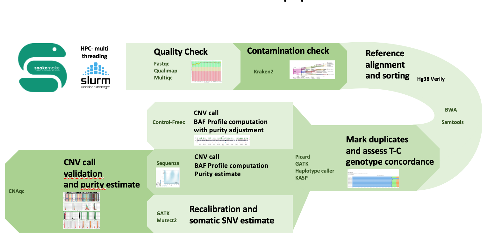

# WES pipeline #

### WES ###

After read quality assessment, reads are aligned to the human reference genome GRCh38_Verily (https://cloud.google.com/life-sciences/docs/resources/public-datasets/reference-genomes) using BWA-MEM (Li et al., 2013). Sorting and indexing of bam alignment files are performed using samtools (Li et al. 2009). Duplicate reads are highlighted with Picard (http://picard.sourceforge.net/) to produce the mapping metrics with Qualimap (García-Alcalde) and Mosdepth (Pedersen et al. 2018). Copy number calling is performed in parallel with Sequenza (Favero et al. 2015) and Control-Freec (Boeva et al. 2012). Somatic SNV calls are predicted with GATK mutect2 (Van der Auwera et al. 2020).  Sample verification by means of genotype profiling - Kompetitive Allele Sample Profiling (KASP) - is performed computationally with GATK-haplotype caller (Van der Auwera et al. 2020, Pengelly et al. 2013) to validate data provenance of WES samples. CNAqc (Househam et al. 2021) was employed to assess quality of allele-specific Copy Number Alterations (CNA), somatic mutations and purity estimates generated from tumour bulk sequencing. Multi-threading was employed whenever possible to speed up each snakemake pipeline step (via slurms job scheduler) on the cluster.

 

 

References 

Andrews, S. (2010). FastQC:  A Quality Control Tool for High Throughput Sequence Data [Online]. Available online at: http://www.bioinformatics.babraham.ac.uk/projects/fastqc/ 

 

Boeva, Valentina, et al. "Control-FREEC: a tool for assessing copy number and allelic content using next-generation sequencing data." Bioinformatics 28.3 (2012): 423-425. 

 

García-Alcalde, Fernando, et al. "Qualimap: evaluating next-generation sequencing alignment data." Bioinformatics 28.20 (2012): 2678-2679. 

 

Garvin, Tyler, et al. "Interactive analysis and assessment of single-cell copy-number variations." Nature methods 12.11 (2015): 1058-1060. 

 

Ewels, Philip, et al. "MultiQC: summarize analysis results for multiple tools and samples in a single report." Bioinformatics 32.19 (2016): 3047-3048. 

 

Favero, Francesco, et al. "Sequenza: allele-specific copy number and mutation profiles from tumor sequencing data." Annals of Oncology 26.1 (2015): 64-70. 

 

Househam, Jacob, William CH Cross, and Giulio Caravagna. "A fully automated approach for quality control of cancer mutations in the era of high-resolution whole genome sequencing." bioRxiv(2021). 

 

Li, Heng. "Aligning sequence reads, clone sequences and assembly contigs with BWA-MEM." arXiv preprint arXiv:1303.3997 (2013). 

 

Li, Heng, et al. "The sequence alignment/map format and SAMtools." Bioinformatics 25.16 (2009): 2078-2079. 

 

Picard. [http://picard.sourceforge.net/] 

Van der Auwera, Geraldine A., and Brian D. O'Connor. Genomics in the Cloud: Using Docker, GATK, and WDL in Terra. O'Reilly Media, 2020. 

 

Pedersen, Brent S., and Aaron R. Quinlan. "Mosdepth: quick coverage calculation for genomes and exomes." Bioinformatics 34.5 (2018): 867-868. 

 

Pengelly, Reuben J., et al. "A SNP profiling panel for sample tracking in whole-exome sequencing studies." Genome medicine5.9 (2013): 1-7. 

 

Wood, Derrick E., Jennifer Lu, and Ben Langmead. "Improved metagenomic analysis with Kraken 2." Genome biology 20.1 (2019): 1-13. 

 

 
