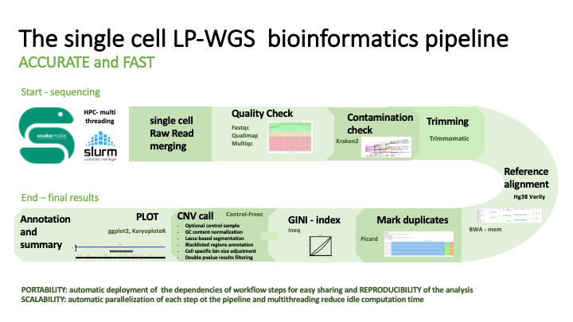

# WGS with Control Freec #

### WGS ###

Quality (FastQC, Andrews et. al 2010) and contaminant check (Kraken2, Wood et. al 2019) are performed as preliminary, mandatory steps of the analysis. Afterword, Raw data are mapped to the human reference genome GRCh38_Verily (https://cloud.google.com/life-sciences/docs/resources/public-datasets/reference-genomes) using BWA-MEM (Li et al., 2013). Sorting and indexing of bam alignment files are performed using samtools (Li et al. 2009). Duplicate reads are first highlighted with Picard (http://picard.sourceforge.net/) to produce the mapping metrics with Qualimap (García-Alcalde) and Mosdepth (Pedersen et al. 2018) and then removed from the alignment files. Sample quality metrics are collected in an html report by MultiQC (Ewels et al., 2016). Only files with at least 1M reads mapping over the human genome after duplicate removal are further processed. Deduplicated files are provided as input to Control-FREEC (Boeva et al. 2012) for Copy Number Variation (CNV) assessment. When the control-lymphocyte sample was present it was used to normalize the raw CN profile, if no control (paired normal DNA to putative tumor cells) cell are available GC-content and mappability profiles are used to normalize the read count. These steps are followed by the analysis of predicted regions of gains and losses to assign copy numbers to each segment. Two independent statistical tests such as Wilcoxon test and Kolmogorov-Smirnov test are applied to the data to select significant CNA (pvalue < 0.01 in both tests). Only copy number changes predicted in autosomes are considered to classify the cells as putative tumor or non-tumor cells. Plots and tables of significant gain/loss CNA distribution across the genome were generated for each cell (Gel et al., 2017).  Multi-threading is employed whenever possible to speed up each snakemake pipeline step (via slurms job scheduler) on the cluster.

